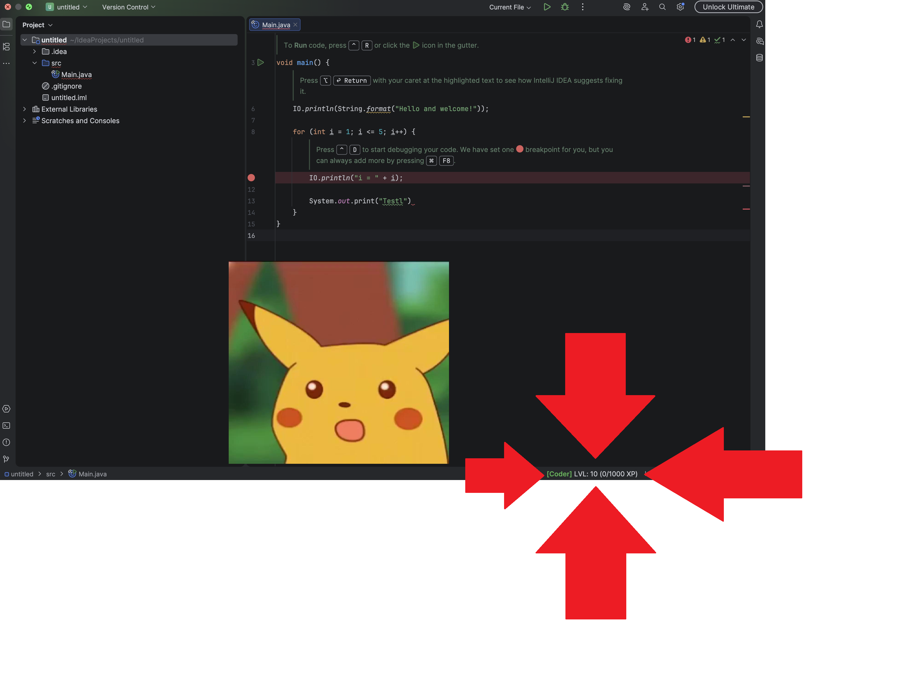

# LevelUPlugin

## ZZPJ - grupa 1 IAS

### Autorzy:
- Danylo Dobrianskyi 258668
- Mateusz Chodulski 252929
- Paweł Rajnert 251618
- Karol Dawid 252931

## Opis pluginu
Poprzez wpisywanie kolejnych znaków w IDE, zdobywamy punkty exp dzięki którym możemy odblokowywać kolejne poziomy. Jest to ciekawe urozmaicenie pracy, z uwagi na to że możemy poczuć się jak w grze, w której zdobywanie nowych poziomów i porównywanie się ze znajomymi jest wyznacznikiem tego kto jest lepszym programistom. Dodatkowo możliwa jest opcja uruchomiania filmów dostępnych w katalogu, aby zmotywować się do dalszej pracy.

## Przedstawienie funkcjonalności pluginu
<video controls src="LevelUPlugin.mp4" title="Showcase"></video>